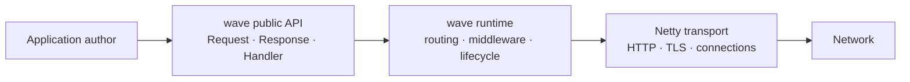
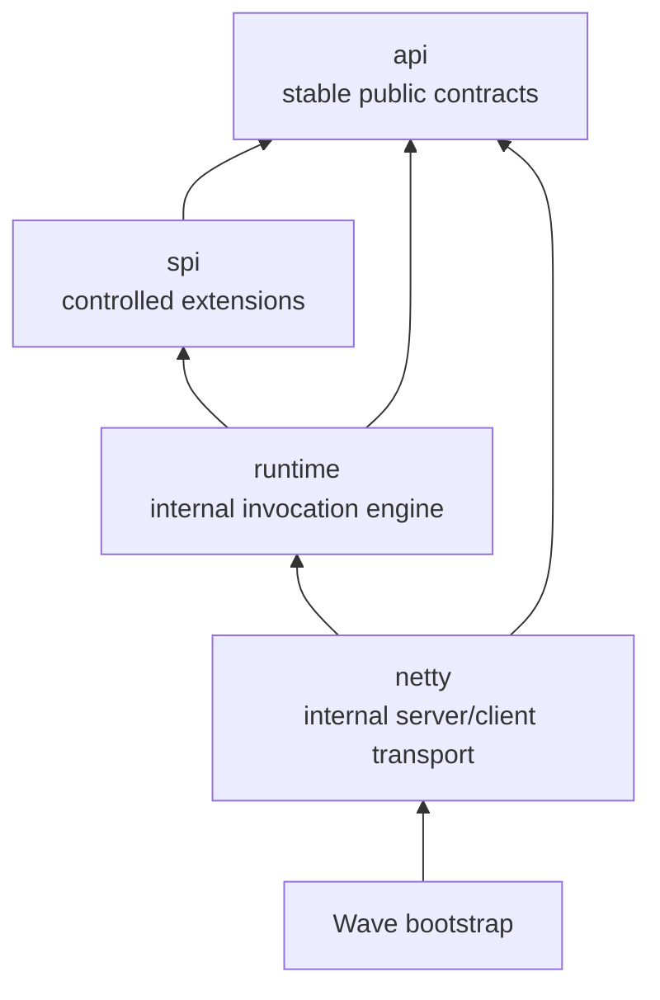

# wave 架構設計書

**狀態：** Architecture Baseline  
**專案名稱：** `wave`  
**Maven 座標：** `io.wavejava:wave`  
**最低 Java：** Java 25  
**Runtime：** Netty  
**發布目標：** 在 1.0 前提供大部分 Ratpack 的 HTTP 應用能力，以更直接的 Java API 與 Virtual Threads 為主要開發模型。

---

## 1. 願景與定位

wave 是一個 Java-first 的 HTTP 應用框架。它吸收 Falcon 的顯式 HTTP API、資源導向 routing 與少抽象原則，也吸收 Ratpack 對 server、client、streaming、testing 與 ecosystem extension 的完整度；但它不複製 Ratpack 的 Promise API、Groovy DSL 或 Guice-centered composition。

wave 的目標使用者可以用一般同步 Java 程式碼建立高併發 HTTP 應用。框架使用 Java Virtual Threads 執行會等待 I/O 的應用邏輯，並用 Netty 處理協定、連線與流量控制。這讓應用程式程式碼保有 direct style，同時不讓可能阻塞的 handler 佔用 Netty EventLoop。



### 1.1 核心承諾

- **Java-first**：Java 25 是唯一的一級語言與文件基準。
- **簡單的預設路徑**：大部分 API 只需要 `Request`、`Response`、`Handler`、`Middleware` 與 route DSL。
- **Netty 隱藏於 transport**：公開 API 不出現 `Channel`、`ByteBuf`、EventLoop、Netty Future。
- **同步業務邏輯、非阻塞 transport**：handler 在 Virtual Thread 執行；EventLoop 不執行使用者程式碼。
- **資源有界**：所有 request、connection、queue、buffer、stream、timeout 都必須有明確 budget。
- **可測試性是核心功能**：每個公開 extension point 都必須可在不開啟真實 socket 的情況下測試；協定行為仍要有真實 transport integration test。測試 fixture 只存在 test source，不進入 production API。
- **Groovy-later**：Groovy 是獨立語言 adapter，不滲入核心 API 或 1.0 關鍵路徑。

### 1.2 非目標

wave 1.0 不包含：

- Groovy script runtime、template engine 或熱載入。
- annotation scanning、隱式 dependency injection 或內建 application container。
- 自訂 Promise、Reactive Streams 或 coroutine framework。
- 內建 Redis、database pool、service discovery、Spring/Guice、template、metrics vendor integration。
- 將零複製或 Netty direct-buffer 操作當成公開編程模型。

這些功能可以透過 SPI 或獨立 artifact 提供；wave 核心只維持必要而穩定的抽象。

---

## 2. 使用者心智模型

wave 的入門路徑只要求一般 application author 先理解四個 Core 概念；其他能力依需求按
`Core → Web → Transport → Operations → Extension` 分層載入。完整的 Ponytail 審查、實際
package 盤點與刪除/保留決策見 [`wave-architecture-review.md`](wave-architecture-review.md)。

| 概念 | 職責 | 一般使用者何時接觸 |
|---|---|---|
| `Request` / `Response` | HTTP 請求與回應 | 每支 handler |
| `Handler` / `Middleware` | endpoint 邏輯與共用處理 | 建立 API 與認證、log、錯誤處理 |
| `Routes` | path 與 HTTP method 到 handler 的映射 | 應用程式組裝時 |
| `WaveApp` / `WaveServer` | 建立應用與啟動 server | `main()` |

```java
var app = Wave.app()
    .middleware(new RequestIdMiddleware())
    .middleware(new AccessLogMiddleware())
    .routes(routes -> {
        routes.get("/health", (request, response) -> response.status(204));
        routes.get("/users/{id}", users::get);
        routes.post("/users", users::create);
    })
    .build();

Wave.server(app)
    .listen(8080)
    .start();
```

```java
final class UserResource {
    private final UserService users;

    UserResource(UserService users) {
        this.users = users;
    }

    void get(Request request, Response response) {
        var user = users.find(request.pathParam("id"));
        if (user == null) {
            throw HttpException.notFound("user_not_found");
        }
        response.json(user);
    }
}
```

`Resource` 只是組織 handler 的一般 Java 類別；wave 不要求繼承基底類別或使用 annotation。

能力分層如下，避免把 0.4–0.9 的 optional capability 誤當成每個 endpoint 都必須理解的 API：

```text
Core       Wave / App / Server / Request / Response / Routes / Middleware
Web        render / form / file / cookie
Transport  client / Flow / multipart / SSE / WebSocket / HTTP/2
Operations session / health / observability / resilience / config
Extension  SPI + testing support
```

---

## 3. 設計原則與不變條件

### 3.1 公開 API 原則

1. 公開 API 採明確名詞與語意，不以 boolean 或位置參數隱藏行為。
2. 一般 endpoint 只有一種主要 handler 形態：`void handle(Request, Response)`。
3. 非同步 SDK 由 Virtual Thread 等待 `CompletionStage`；串流由 `Response.stream(Flow.Publisher<ByteBuffer>)` 表達，不要求使用者另選一種 route/handler 型別。
4. 應用程式依賴採 constructor injection；`Registry` 只用於 framework services 與 extension discovery。
5. 不可變資料優先：`Request`、route table、config、registry 在啟動完成後不可變。

### 3.2 Runtime 原則

1. Netty EventLoop 僅執行協定、connection state、decode/encode、backpressure、排程與 write completion。
2. 所有 handler、middleware、parser、renderer、session store、health check 與 lifecycle hook 均不可在 EventLoop 直接執行。
3. `ByteBuf` 的 ownership 不跨越 `io.wavejava.wave.netty`。
4. client disconnect、deadline、shutdown 一律轉為 `CancellationToken`；`Thread.interrupt()` 是協作式取消訊號，不可取代下游 timeout。
5. HTTP/1.1 必須保持 response order；HTTP/2 以 stream 為獨立執行與 flow-control 單位。

### 3.3 資源原則

任何可累積的項目都需要 count、byte 或 time budget：

- active connections
- in-flight requests
- header、body、multipart memory/disk bytes
- per-connection pending requests
- queued/streaming response bytes
- WebSocket/SSE outbound bytes
- request、read、write、idle、shutdown timeout

上限達到時的行為必須是明確拒絕、暫停 read 或取消；不得用無界 queue 延後失敗。

### 3.4 0.1 API 與 body 邊界

0.1 的公開核心為 `Wave`、`WaveApp`、`WaveServer`、`Request`、`Response`、`Body`、
`Handler`、`Middleware`、`Routes`、`Outcome`、`HttpException` 與 `ExceptionMapper`。
這些型別的基本語意在 0.1 即受 contract test 保護；0.x 可以新增能力，但不得以未完成的
後續能力作為 0.1 的隱性前提。

0.1–0.3 的 `Body` 只有有上限的聚合讀取模式。首次呼叫 `bytes()`、`text()`、`json()` 或
`form()` 會取得 body；後續任何讀取都必須失敗。`Flow.Publisher<ByteBuffer>` 的 request/
response streaming、multipart streaming parser 與大型檔案 upload 直到 0.4 才引入，且與
聚合模式互斥。不得以無界記憶體、背景 thread 或假串流提前提供這些能力。

`Response` 在 handler 返回時若仍為 `OPEN`，視為 application failure。commit 前的例外交給
exception mapper；commit 後的例外不可產生第二個 response，transport 必須中止寫出並記錄
失敗 outcome。middleware 在 `onRequest` 或 `onRoute` commit response 時短路後續 pipeline，
但所有已進入的 middleware 仍必須依反向順序收到 `onResponse`。

`Response` 只公開狀態、headers、writer 與 lifecycle methods。bytes、JSON、problem、stream 與
WebSocket upgrade 的 payload representation 收在未 export 的 `internal.http.ResponseData`，
由 transport 透過單一 `ResponseDataReader` 讀取；application 不可依賴 transport body union。

---

## 4. 系統結構

### 4.1 分層與依賴方向

wave 採單一 Maven module，但以 package-level architecture 維持單向依賴。



| 區域 | 可依賴 | 相容性 |
|---|---|---|
| `api.*`（含 `api.render`、`api.form`、`api.file`） | JDK 與明確公開的 SPI types；`WaveClient`、`WebSocketClient`、`Response` 僅保留 private framework wiring | 1.x 穩定公開 API |
| `spi.*` | `api.*` | 受控擴充 API，具遷移政策 |
| `runtime.*` | `api.*`、`spi.*` | internal，不保證相容 |
| `netty.*` | `runtime.*`、`api.*` | internal，不保證相容 |
| `internal.*` | 任何必要內部 package | 永不公開 |

JPMS module 名稱固定為 `io.wavejava.wave`，僅 export 根入口、`api.*` 與 `spi.*` package；
`runtime.*`、`netty.*`、`internal.*` 不得 export。需要穩定公開的
file/form/render 型別一律置於 `api.*`。
ArchUnit 會驗證上述依賴方向，並限制三個 facade 的 implementation wiring 不得進入 public
signature；`validate-naming.ps1` 也會檢查 API package 的公開宣告。0.8 起 Revapi 驗證 `api.*` 與 `spi.*` 的二進位相容性；Maven
Enforcer 固定 Java 與依賴收斂規則。

正式 release 尚未存在時，`_spec/wave-api-compatibility.md` 是 source-level 的預發布 public-surface
snapshot：`ModuleDescriptorTest` 必須逐項比對 export、`uses` 與 transitive `requires`。它不是 binary
compatibility baseline；只有不可變、可追溯且已發布的 `io.wavejava:wave:<version>` artifact 才可餵給 Revapi。

### 4.2 專案資料夾結構

```text
wave/
├── pom.xml
├── mvnw
├── mvnw.cmd
├── .mvn/wrapper/
├── src/
│   ├── main/
│   │   ├── java/io/wavejava/wave/
│   │   │   ├── Wave.java
│   │   │   ├── api/
│   │   │   │   ├── http/          # Request, Response, headers, cookies, body state
│   │   │   │   ├── routing/       # Routes, Handler, route metadata
│   │   │   │   ├── middleware/
│   │   │   │   ├── render/        # Renderer, Parser, media types
│   │   │   │   ├── form/          # bounded URL-encoded form values
│   │   │   │   ├── file/          # bounded static/file response API
│   │   │   │   ├── stream/        # public Flow-based streaming types
│   │   │   │   ├── client/
│   │   │   │   ├── sse/
│   │   │   │   ├── websocket/
│   │   │   │   ├── session/
│   │   │   │   ├── config/
│   │   │   │   ├── registry/
│   │   │   │   ├── observability/
│   │   │   │   ├── health/
│   │   │   │   ├── lifecycle/
│   │   │   │   └── testing/
│   │   │   ├── spi/
│   │   │   ├── runtime/
│   │   │   ├── netty/
│   │   │   └── internal/
│   │   └── resources/META-INF/services/
│   ├── test/java/io/wavejava/wave/
│   │   ├── unit/
│   │   ├── integration/
│   │   ├── contract/
│   │   ├── architecture/
│   │   └── load/
│   └── (JMH/load tools live in tools/wave-benchmarks/)
├── examples/
│   ├── hello-api/
│   ├── forms-and-files/
│   ├── streaming-api/
│   ├── websocket-chat/
│   └── gateway-api/
└── docs/
    ├── architecture/
    ├── adr/
    ├── guides/
    ├── operations/
    └── compatibility/
```

`_spec/wave-roadmap.md` 是版本、任務狀態、驗收命令與可查驗結果的唯一來源；本文件只保存
架構決策與能力邊界。

---

## 5. Application 與請求生命週期

### 5.1 Application 組裝

`WaveApp` 是在啟動時完全建立的不可變物件。它持有 compiled route table、middleware list、exception mapper、renderer/parser registry、configuration 與 application lifecycle。

```java
var app = Wave.app()
    .config(config)
    .registry(frameworkServices)
    .middleware(authentication)
    .exceptionMapper(DomainException.class, Errors::fromDomain)
    .routes(AppRoutes::define)
    .build();
```

`build()` 必須完成以下檢查：route ambiguity、duplicate method/path、middleware contract、renderer/parser priority、config validation、service dependency cycle 與 lifecycle order。驗證失敗時不允許 bind port。

### 5.2 請求流程

```mermaid
sequenceDiagram
    participant E as Netty EventLoop
    participant D as Dispatch adapter
    participant V as Virtual Thread
    participant P as wave pipeline
    participant H as Application handler

    E->>D: Decode request
    D->>D: Enforce limits; snapshot body; release ByteBuf
    D->>V: Submit invocation with deadline
    V->>P: onRequest
    P->>P: Route match
    P->>P: onRoute
    P->>H: Handler
    H-->>P: Response state
    P->>P: Error map and onResponse
    P-->>D: Completed response
    D->>E: Schedule ordered write
    E->>E: Encode, flush, record transport outcome
```

### 5.3 Middleware 契約

```java
public interface Middleware {
    default void onRequest(Request request, Response response) throws Exception {}
    default void onRoute(Request request, RouteMatch route, Response response) throws Exception {}
    default void onResponse(Request request, Response response, Outcome outcome) {}
}
```

| 階段 | 順序 | 可做的事 | 保證 |
|---|---|---|---|
| `onRequest` | 註冊順序 | request ID、CORS、認證、全域限流、短路 | 已進入 middleware 必定參與 unwind |
| route match | 固定 | path/method match、404、405、`Allow` | route table 不可變 |
| `onRoute` | 註冊順序 | 授權、resource rule、route metric tag、短路 | 僅在 route match 成功時執行 |
| handler | 固定 | application logic | 例外進入 error mapping |
| error mapping | 固定 | 例外轉 problem response | 已提交 response 不可改寫 |
| `onResponse` | 反向註冊順序 | access log、metrics、cleanup | 已進入 middleware 一律執行 |
| transport completion | EventLoop | 記錄 bytes、flush result、disconnect | 獨立於 application outcome |

`Outcome` 必須區分 handler 成功、application failure、deadline、client cancellation 與 transport write failure；access log 不得將已計算完成但寫出失敗的 response 記作成功傳送。

### 5.4 Routing

Router 在啟動時將 routes 編譯為 segment tree，而非每次 request 用 regex 掃描。優先序固定為 static > parameter > wildcard；同一層級有歧義時 `build()` 失敗。

支援：

- HTTP methods：GET、HEAD、POST、PUT、PATCH、DELETE、OPTIONS 及 custom method。
- exact path、parameter segment、path prefix、catch-all。
- nested route scope、route metadata、method negotiation。
- automatic HEAD from GET，除非明確覆寫。
- automatic OPTIONS 與 `Allow`，除非明確覆寫。
- content negotiation 與 route-local consumes/produces constraint。

---

## 6. HTTP 模型、Body 與 Rendering

### 6.1 Request

`Request` 是不可變 view，提供：

- method、scheme、authority、path、raw query、remote address、protocol version。
- case-insensitive headers、多值 query、cookies、path parameters。
- `RequestContext`、deadline、`CancellationToken`、route metadata。
- `Body`：可聚合 body 的 `bytes()`、`text()`、`json(type)`、`form()`，以及 streaming body API。

Body 只能讀取一次。聚合 body 與 streaming body 不可混用；第二次嘗試會丟出明確狀態錯誤。

### 6.2 Response

`Response` 是 request invocation 所屬的可變 builder，狀態為 `OPEN`、`COMMITTED`、`COMPLETED`、`ABORTED`。它提供：

```java
response.status(201)
    .header("Location", location)
    .cookie(cookie)
    .json(created);

response.problem(Problem.of(422, "validation_failed"));
response.redirect(303, "/users/42");
response.text("ok");
response.bytes(bytes, MediaType.APPLICATION_OCTET_STREAM);
FileResponse.of(path).writeTo(request, response);
response.render(rendered);
response.stream(publisher);
```

headers/body 一旦 committed 不得變更。所有 renderer 必須在 commit 前決定 media type、content length 或 transfer mode。

### 6.3 Parser 與 Renderer

```java
public interface Parser<T> {
    boolean supports(ParseTarget<T> target, MediaType mediaType);
    T parse(Body body, ParseTarget<T> target) throws Exception;
}

public interface Renderer<T> {
    boolean supports(Class<?> type, MediaType accepted);
    Rendered render(T value, RenderContext context) throws Exception;
}
```

內建 parser/renderer：

- JSON（Jackson）
- text / bytes / `ByteBuffer`
- URL encoded form
- multipart form 與 file part
- `Problem` (`application/problem+json`)
- static/templated file response
- SSE event stream

自訂 parser/renderer 透過 registry 或 `ServiceLoader` 註冊，priority 衝突在啟動期偵測。

### 6.4 Multipart 與檔案

小型 form 可以聚合；multipart file upload 必須 streaming parse，將每個 part 表達為受限資料流或安全 temporary file。檔案服務必須：

- 將 URL path 正規化並限制於 configured root。
- 防止 path traversal 與 symbolic-link escape。
- 處理 MIME、ETag、Last-Modified、If-None-Match、If-Modified-Since、Range。
- 使用零複製作為 Netty transport optimization，而非公開 API 要求。

---

## 7. Execution、取消與 Backpressure

### 7.1 Virtual Thread execution

request invocation 使用 `Executors.newVirtualThreadPerTaskExecutor()`。不建立 virtual-thread pool；並發保護透過 request permits、connection limits、下游 pool 與 byte budget 實現。

每個 invocation 建立 `RequestContext`，並以 Java 25 `ScopedValue` 綁定 request ID、trace context、principal、deadline 與 cancellation token。公開 API 仍以 `request.context()` 為主，避免使用者對 `ScopedValue` 產生版本耦合。

### 7.2 非同步與 Streaming

wave 不建立自有 Promise。與既有 async SDK 整合時，framework adapter 以 request deadline 等待 `CompletionStage`。Streaming 使用 JDK `Flow.Publisher<ByteBuffer>`；wave transport 是 subscriber，只有 channel 可寫且有 byte budget 時才 request 下一批資料。

```java
void export(Request request, Response response) {
    response.stream(exports.generate(request)); // Flow.Publisher<ByteBuffer>
}
```

### 7.3 Cancellation

取消來源包括 client disconnect、request deadline、server shutdown、HTTP/2 stream reset、WebSocket close。取消順序：

1. 標記 `CancellationToken`。
2. interrupt invocation virtual thread。
3. cancel `CompletionStage` bridge 或 `Flow.Subscription`。
4. 停止 outbound write 並釋放未寫 buffer。
5. 記錄 cancellation reason 與完成時間。

應用程式必須為 JDBC、HTTP client、filesystem 與外部 SDK 設定自己的 timeout；interrupt 不保證下游立即停止。

### 7.4 HTTP/1.1 pipelining

同一 HTTP/1.1 connection 的 request 可並行計算，但 response 必須依 ingress sequence 寫出。`ConnectionSequencer` 對每個 request 配發 sequence，將已完成 response 存入有界 completion map，僅寫出下一個 sequence。當 pending request 或 buffered response 觸及上限時，adapter 暫停 `autoRead`。

### 7.5 HTTP/2

HTTP/2 只透過 TLS/ALPN 的 `h2` 啟用；不支援 h2c prior-knowledge，也不支援 HTTP/1.1 Upgrade。`Http2Config` 是 server/client 共用的不可變限制快照，至少包含最大 concurrent streams、header-list、frame、stream window、connection receive window 與 framework-owned inbound/outbound byte budgets。connection receive window 不得低於 RFC 7540 固定的 65,535 bytes：協定沒有可降低它的 SETTINGS，設定較小值必須在 assembly 時拒絕，不能靜默假裝已生效。

HTTP/2 以 stream 作為獨立 deadline、cancel 與 Flow demand 單位；connection window 與 stream window 是 peer flow control，不能取代 framework retention budget。為了讓 memory proof 可直接驗證，Wave 將 connection-level request/response body budget 靜態分成最多 `maximumConcurrentStreams` 份：每一個 aggregate 或 Flow inbound stream、每一個有限-byte client request/response stream 只能取得自己的 partition。此作法可能留下未使用容量，但不建立 hidden shared queue，且所有同時 active stream 的保留總和有明確上限。

server shutdown 的順序固定為：停止 listener、立即關閉 HTTP/1.x／未協商 peer、對已協商 HTTP/2 parent 送 `GOAWAY(NO_ERROR)`、停止新 stream admission、在既有 shared shutdown budget 內讓已接收 stream 完成，最後才取消未完成 invocation 並關閉 parent。client 收到 `GOAWAY` 後不再在該 parent 開新 stream；尚未開 stream 的工作回到 bounded pending admission，超過 peer `last-stream-id` 的 exchange 視為 transport failure，僅在既有 idempotency-safe retry policy 容許時重送。route 選擇與 physical-parent accounting 必須分離：draining parent 雖不再可供同 route 選擇，仍持續占用 `ClientRequestPool.maximumConcurrentRequests()` 的一個 slot，直到其 `closeFuture` 完成；因此 map replacement 不得使連線上限失效。

`RST_STREAM`、disconnect、deadline 與 shutdown 都必須取消 request context、interrupt invocation virtual thread、cancel request/response `Flow.Subscription`、釋放其唯一 transport-owned item，且只影響該 stream。parent-level overload、frame/header protocol error 與 GOAWAY 則依 HTTP/2 error scope 關閉或 drain parent；任何一種路徑都不能讓一條 stream 長時間飢餓其他已可寫 stream。

---

## 8. Netty Transport

### 8.1 Server pipeline

```text
TLS / ALPN (optional)
  → HTTP/1.1 decoder or HTTP/2 frame codec
  → header and initial-line limits
  → request body aggregation or streaming dispatcher
  → RequestDispatchHandler
  → ResponseWriteHandler
```

`RequestDispatchHandler` 是唯一直接接觸 inbound `ByteBuf` 的邊界。對聚合 request，它在 EventLoop 中檢查限制、copy bytes 到 framework-owned storage，並在 `finally` release Netty message；對 streaming request，它建立受背壓控制的 body publisher。

所有 channel state transition、pipeline mutation 與 writes 都排回 EventLoop。Application code 永遠不觸碰 channel。

### 8.2 HTTP client

`WaveClient` 提供 blocking 與 async API，並使用 Netty connection pool：

```java
var received = client.execute(client.get(uri));
var future = client.executeAsync(client.get(uri));
```

公開 client body 契約是有限 byte request/response；JDK `Flow` 的公開 request/response body 契約屬於 server `Request.streamingBody()` 與 `Response.stream(...)`。client 不假裝提供未受測的 streaming API；若未來新增，必須是與 byte body 互斥的新公開契約，並具備 demand、ownership、slow-consumer、cancel 與 retry-safety tests。client lifecycle 可獨立使用，不隸屬於 server shutdown。

公開 `WaveClient` 不暴露 Netty 或 JDK transport type。內部 Netty transport 僅在 reusable HTTP/1.1 channel 已回到 bounded idle cache、HTTP/2 stream 到達 END_STREAM／physical close，或 parent `closeFuture` 完成後才釋放實體 exchange。每個 `WaveClient` 的 physical parent/channel cache 受 `ClientRequestPool.maximumConcurrentRequests()` 限制；共用 `ClientRequestPool` 僅共用 request budget，並不把多個 client 的實體 cache 合併。

HTTP/1.1 支援 direct TLS 與 HTTP proxy absolute-form request。啟用 HTTP/2 後，HTTPS 經 HTTP proxy 固定先進行有限 header 的 CONNECT tunnel，再做 origin TLS、SNI、hostname verification 與 ALPN；不能把 proxy TLS 驗證誤當 origin 驗證。`PREFER` 可於 direct origin ALPN 回落 HTTP/1.1；經 CONNECT tunnel 的回落必須有獨立的 HTTP/1.1 tunnel test 才可宣告支援。HTTP/2 parent 支援 multiplex、static byte partition、explicit reset cancellation、GOAWAY retirement 與 bounded LRU reuse。

### 8.3 TLS 與公開位址

TLS configuration 包含 certificate/key、trust store、ALPN、cipher policy、client authentication 與 reload policy。`PublicAddress` 與 forwarded-header trust policy 必須獨立設定；不得盲目信任 `X-Forwarded-*` 或 `Forwarded`。

`ForwardedHeaderPolicy` 預設 disabled。只有 immediate remote peer 命中有限 trusted CIDR allowlist 時，才接受單一、完整且語法正確的 RFC 7239 `Forwarded` origin；multi-hop、重複、malformed 或 untrusted header 一律 fail closed 為 direct socket origin。legacy `X-Forwarded-*` 必須顯式 opt-in。這只衍生 `Request.publicAddress()`，絕不改寫 wire `scheme`、authority、target 或 downstream security input。

---

## 9. 長連線功能

### 9.1 Server-Sent Events

SSE 建構在 response stream 之上，提供 event、id、retry、comment/heartbeat。每個訂閱者有獨立 outbound byte budget；慢 client 觸及上限時以明確策略斷線或丟棄可丟失事件，不能讓記憶體累積。

### 9.2 WebSocket

WebSocket 提供 text、binary、ping/pong、close、subprotocol 與以 `Flow` 表達的 inbound application data。server endpoint 維持既有 handler/route 模型：HTTP upgrade 仍經過 routing、middleware 與 virtual-thread invocation，成功寫出 `101` 後才啟動 endpoint。

```java
routes.websocket("/chat", socket -> {
    socket.inbound().subscribe(new ChatSubscriber(socket));
    socket.sendText("connected");
});
```

`WebSocketSession.inbound()` 只發布 application `TEXT`／`BINARY` 資料，以及在尚有 demand 時的一個 terminal `CLOSE` notification；transport Ping/Pong 不消耗 application demand，並由 session 自動處理。application 仍可透過 bounded `send`、`ping`、`pong`、`close` 發送 outbound message。

WebSocket handler 不在 EventLoop 執行。所有 application callback 回到 invocation executor；close handshake、idle timeout、maximum frame/message bytes、inbound retention、data/application-control/mandatory-control/close outbound reserves 都是必填限制。慢 application subscriber 不得阻塞 Ping/Pong/close 的 protocol progress。

`WebSocketClient` 採 owned Netty direct-`ws` transport、有限 connection admission 與 physical `closeFuture` resource ownership；不重用有限 byte 的 HTTP `WaveClient` pool。`wss`、proxy/redirect/retry WebSocket 與 RFC 8441 extended CONNECT 並非這個 1.0 single-artifact contract；它們必須先各自具備 TLS、proxy、close、cancellation 和 overload transport matrix，不能以 HTTP/2 已存在為理由隱性宣告可用。

---

## 10. Application Services

### 10.1 Registry

`Registry` 是型別化、不可變、可分層的 framework service lookup：config、renderer、parser、session store、health check、client、metrics bridge 等可以在此取得。業務服務依賴仍應採 constructor injection。

```java
var registry = Registry.builder()
    .add(HttpClient.class, client)
    .add(SessionStore.class, store)
    .build();
```

Registry 不執行 classpath scan，不成為通用 service locator。

### 10.2 Lifecycle

`Service` 提供 start/stop lifecycle，具 dependencies 與 timeout。啟動依 dependency order；啟動失敗時 reverse rollback；關閉持續釋放其他 service，即使某一個 service 失敗。

```java
public interface Service {
    CompletionStage<Void> start(ServiceContext context);
    CompletionStage<Void> stop();
}
```

### 10.3 Config

Config 由下列來源合併，後者優先：defaults、properties/YAML/JSON file、environment、system properties、programmatic override。每個 source 都保留 provenance，typed binding 失敗要提供 path、source 與期望型別。

Config 在 startup 完成後不可變。動態 reload 不是 1.0 核心功能；若日後加入，必須使用 versioned snapshot，不可就地修改 application config。

### 10.4 Session

Session 採「signed opaque identity + server-side state」：`SessionId` 是 256-bit URL-safe random token，cookie 僅攜帶 ID、expiry 與 HMAC-SHA-256 signature，不能攜帶 attribute 或使用者資料。`SignedSessionCookieCodec` 要求至少 256-bit signing secret；cookie policy 預設為 `Secure`、`HttpOnly`、`SameSite=Lax`，且有明確 wire-size 上限。

`SessionStore` 是公開 storage contract；1.0 內建 `InMemorySessionStore`，其 live session count 有固定上限、每次操作清除 expired entry、滿載時明確拒絕而非無界淘汰。每個 `Session` 的 attribute count/bytes、idle timeout、absolute timeout 與 rotation interval 都由 `SessionPolicy` 限制。rotation 必須以 store 的 atomic `rotate(previousId, replacement)` 使舊 ID 不再可用；rotation race 或 expiry 時清除所有已知 ID 與 client cookie，不得簽發沒有 trusted store record 的新 credential。

Session persistence 是顯式的 request scope：application 以 `SessionManager.open(request)` 取得 `SessionScope`，並在選擇 response body 前呼叫 `scope.commit(response)`。這個規則避免 response commit 後才嘗試追加 `Set-Cookie` 而遺失 rotation／invalidate；session middleware 與 provider discovery 是 0.8 的擴充工作，不是隱藏 hook。

### 10.5 Health 與 Observability

- `HealthRegistry` 將 liveness 與 readiness 分開：liveness 只反映 process lifecycle；readiness 只在 `READY` 狀態執行必要 checks。check 名稱低 cardinality，check count、並行 evaluation 與每項 deadline 均有限；容量耗盡、timeout、exception 或 null result 都安全地回報 DOWN，不建立等待 queue。`HealthEndpoints` 僅提供明確註冊的 handler，不自動暴露營運路徑。
- `AccessLogEvent` 是每個 HTTP request 的 immutable completion record：stable request ID、method、matched route pattern／低 cardinality label、status、monotonic latency、已成功寫出的 logical response body bytes、application outcome 與 transport outcome。它不保留 raw path/query、header、cookie、body、Throwable 或 exception message；`status=0` 表示尚未取得 HTTP response，upgrade 的 bytes 可為 unknown。`WRITTEN` 只表示完整 HTTP response 的 Netty write completion，絕不宣稱 peer 已收到資料。
- 觀測資料流有兩個不可混淆的終態軸：`WaveApp` 產生 application response/outcome/route，`RequestDispatchHandler` 在 aggregate write、stream terminal write、upgrade 或 connection teardown 產生 transport outcome。middleware `onResponse` 不會因 transport failure 重跑。stream response 只在每個 chunk 寫入成功後累加 bytes，並在 terminal chunk 完成時發出事件。
- `Observability` 將 access-log、`MetricsBridge`、`TracingBridge` 與 `PrometheusBridge` callback 送入一個專用、單 worker、有界 queue。full queue 丟棄新 event，不阻塞 application 或 EventLoop；callback failure 相互隔離；server shutdown 以既有 shared shutdown budget 做有限 drain。預設 disabled 時不配置 worker。Prometheus handler 必須由 application 明確 route 註冊，framework 不自動綁定 `/metrics`；Micrometer/OpenTelemetry 等 vendor adapter 留給 0.8 provider/SPI。

### 10.6 SPI discovery

`spi.*` 是唯一 extension boundary。1.0 的 provider family 為 parser、renderer、session store 與 lifecycle service，統一繼承 `WaveProvider` 的 stable `id`、`selectionKey` 與 priority 語意。`SpiCatalog` 是 immutable assembly snapshot；`ServiceLoader` 只在 `WaveApp` build 時執行，永不在 request path scan classpath。

每個 family 都有有限 provider cap（預設 128）。重複 id、相同 selection key 且相同 priority、null metadata 或 provider factory failure 都必須在 listener bind 前以 `SpiConfigurationException` 失敗。priority 排序是 deterministic；service provider 每次 server run 建立 fresh `Service`，仍受既有 dependency graph、rollback 與 reverse-stop lifecycle 管理。外部 provider 必須能只依賴 exported `api.*`/`spi.*` 與 `spi.testing.ProviderContract` 獨立驗證。

---

## 11. Resilience 與安全

### 11.1 Resilience

wave 提供可組合 middleware 或 client policy：deadline propagation、retry、exponential backoff/jitter、bulkhead、rate limit、circuit breaker integration point。retry 預設只適用可安全重試的 client request；非 idempotent request 需由使用者明確 opt in。

0.6 的 `RateLimitPolicy` 是 no-queue token bucket middleware：identity key 必須低 cardinality 且有 UTF-8 byte cap；live bucket table、idle lifetime 與每 request sweep work 都有限，滿載或 token 耗盡回應 `429`／`Retry-After`，不 evict active identity 來掩蓋 overload。`BulkheadPolicy` 是 fair semaphore、零等待 queue；滿載立即 `503`，permit 僅在 middleware reverse unwind 釋放，因此 cancellation 後尚未結束的 application work 不會被過早重複 admission。兩者均不建立背景 worker 或無界 retained state。

### 11.2 HTTP 安全基線

- header/body/form/file size limits。
- HTTP/1.1 request framing guard：拒絕 duplicate `Content-Length`、`Content-Length` + `Transfer-Encoding`、非 chunked transfer encoding、ambiguous/missing `Host` 與 connection framing header。
- HTTP/2 conformance：禁止 connection-specific header、非 `trailers` 的 TE、非法 pseudo-header/header-list/frame，且這些 input 永不 dispatch application handler。
- trusted proxy allowlist 與 strict `Forwarded` parsing。
- secure cookie、SameSite、HttpOnly、session rotation。
- multipart filename normalization、temporary file cleanup。
- CORS policy middleware。
- error response 不洩漏 internal exception details。
- TLS configuration validation。

認證與授權是 middleware extension，wave 內建其 integration contract 與 context propagation，但不綁定 OAuth/OIDC provider。

---

## 12. Testing 與品質

### 12.1 測試工具

| 工具 | 用途 |
|---|---|
| `RequestFixture` | test source；不開 server，測 handler/middleware/parser/renderer |
| `EmbeddedApp` | test source；以 ephemeral port 啟動完整 application |
| `TestHttpClient` | test source；HTTP/1.1、HTTP/2、cookie、redirect、file、form 測試 |
| test-scope-only `TestHttp2Peer`／`TestHttp2WirePeer` | TLS/ALPN raw H2 headers、RST、GOAWAY、window、invalid protocol input 與 direct wire empty-DATA flood；有有限 wait、無 production export |
| test-only package-private `TestWebSocketClient` | raw `ws` handshake、masked/unmasked frame、fragmentation、protocol close、TCP FIN/RST、bounded read 的 transport tests；不是公開 API |
| `TestSseClient` | event、retry、heartbeat、disconnect 測試 |
| `MockUpstream` | test source；模擬外部 HTTP client dependency |
| `ExecutionHarness` | deadline、cancellation、`CompletionStage`、`Flow` 測試 |

### 12.2 必要測試矩陣

每個 transport feature 在 merge 前都必須覆蓋：

- success、client error、server error。
- timeout、cancellation、disconnect。
- slow reader / slow writer。
- size/concurrency/byte-budget over-limit。
- graceful shutdown during in-flight request。
- Netty `ByteBuf` leak detection。

CI 會在 adapter integration suite 中以 `PARANOID` leak detector 執行；效能 benchmark 另以正常設定執行，避免檢測成本干擾量測。

### 12.3 Benchmark

JMH 與 load suite 至少量測：

- 小 JSON request/response。
- JDBC/remote HTTP 等待型 handler。
- upload/download/streaming。
- HTTP/2 multiplexing。
- SSE/WebSocket slow consumer。
- CPU、heap、direct memory、allocation、p50/p95/p99/p99.9、error rate。

---

## 13. Groovy 擴充策略

Groovy 不進入 wave 1.0 核心。只要 `api.*` 與 `spi.*` 在 1.0 freeze，Groovy 可在獨立 `wave-groovy` artifact 以 adapter 建構，而不需要改動單一 Maven module 的 wave 本體。

```text
wave-groovy
  ├── WaveGroovy             # application entry DSL
  ├── GroovyRoutes            # Closure → Routes adapter
  ├── GroovyHandlerAdapter    # Closure → Handler adapter
  ├── GroovyRendererAdapter
  └── type-checking support
```

Groovy adapter 原則：

- 僅依賴 `api.*` 與 `spi.*`，絕不依賴 `runtime.*`、`netty.*`、`internal.*`。
- 預設支援 `@CompileStatic`；DSL 使用 `@DelegatesTo` 和 `Closure.DELEGATE_ONLY`。
- Groovy closure 只在 application build time 建立 route tree，不允許直接修改 running application。
- core API 避免 closure/lambda overload，避免 Groovy method-selection ambiguity。
- GString、Map、Closure 在 adapter 邊界正規化，core 仍保持 Java 的 `String`、typed config 與 `Handler`。

Groovy script loading、hot reload 與 sandbox 是獨立 developer-tooling 專案，不能混入 server runtime。

---

## 14. 依賴與發佈

wave 為單一 artifact：

```xml
<dependency>
  <groupId>io.wavejava</groupId>
  <artifactId>wave</artifactId>
  <version>1.0.0</version>
</dependency>
```

核心依賴：Netty、Jackson、SLF4J API。Micrometer、OpenTelemetry、Redis、template engine 等採 optional dependency 與 SPI provider。單一 artifact 讓初期採用與 release 簡單；public package boundary 確保未來可在不破壞 API 的情況下拆分 `wave-groovy` 或其他 integration artifact。

---

## 15. Roadmap 與 Release Gate

| 版本 | 主題 | 完成內容 |
|---|---|---|
| `0.1` | 可用核心 | server lifecycle、HTTP/1.1、route tree、Handler/Middleware、error mapping、JSON/text/bytes、RequestFixture、EmbeddedApp |
| `0.2` | 執行正確性 | Virtual Thread dispatch、deadline/cancellation、HTTP/1.1 sequencing、limits、TLS、compression、graceful shutdown |
| `0.3` | Web 基礎能力 | content negotiation、URL-encoded form、file/static、range/conditional、cookies、config、Registry/lifecycle；不含 multipart |
| `0.4` | Client 與資料流 | `CompletionStage` bridge、Flow streaming、HTTP client/pool、retry/backoff、mock upstream |
| `0.5` | 長連線 | SSE server/client、WebSocket server/client、heartbeat、broadcast、slow-client handling |
| `0.6` | Microservice operations | session SPI/in-memory store、health/readiness、metrics/tracing bridge、Prometheus、rate/bulkhead policies |
| `0.7` | HTTP/2 完整性 | ALPN、HTTP/2 server/client、flow control、proxy/public address、安全與 overload suite |
| `0.8` | 擴充穩定 | parser/renderer/session/service SPI、ServiceLoader、external-provider contract kit、API compatibility baseline |
| `0.9` | Release candidate | documentation、examples、migration guide、JMH/load baseline、dependency/security review、release automation |
| `1.0` | 穩定發布 | public API freeze、SemVer policy、compatibility suite、production operation guide |

每個版本的 gate 是功能行為、取消、資源上限與 shutdown 行為皆可驗證，不以「API 可以呼叫」作為完成標準。
0.3 不交付 multipart/file upload；它與 Flow request body 一併移至 0.4。各版本的元件清單、
任務拆分與測試命令見 `_spec/wave-roadmap.md`。

---

## 16. ADR 清單

- **ADR-001**：專案、artifact 與根 package 使用 `wave`、`io.wavejava:wave`、`io.wavejava.wave`。
- **ADR-002**：採單一 Maven module，以 package-level architecture 維持邊界。
- **ADR-003**：Java 25 為最低版本；公開 API 不採 preview feature。
- **ADR-004**：Netty 是 server/client transport；公開 API 不暴露 Netty type。
- **ADR-005**：一般 handler 為同步 direct style，預設由 Virtual Thread 執行。
- **ADR-006**：不建立自有 Promise；非同步採 `CompletionStage`，streaming 採 JDK `Flow`。
- **ADR-007**：`ByteBuf` ownership 限制於 Netty adapter，聚合 request 採 copy-then-release。
- **ADR-008**：HTTP/1.1 response order 由 connection sequencer 保證；HTTP/2 以 stream 為單位。
- **ADR-009**：1.0 前支援 Ratpack 的主要 HTTP 能力，但 vendor integrations 以 SPI 提供。
- **ADR-010**：Registry 用於 framework services；業務依賴採 constructor injection。
- **ADR-011**：Groovy 是 1.0 後的獨立 adapter，不進入核心 runtime。
- **ADR-012**：所有 queue、buffer、connection 與並發有 byte/count/time budget。
- **ADR-013**：HTTP/2 只支援 TLS/ALPN；h2c 與 Upgrade 不進 1.0。
- **ADR-014**：HTTP/2 connection body budget 採 static stream partition，優先可驗證的 memory bound。
- **ADR-015**：provider discovery 僅於 application assembly；公開 API binary compatibility 只在 immutable release baseline 存在後由 Revapi fail-closed 驗證。

---

## 17. 參考能力地圖

wave 的功能範圍對照 Ratpack 的 HTTP application capabilities：server/config、handler/routing、parser/renderer、file/form、HTTP client、health/lifecycle、SSE、WebSocket、session、registry、streaming 與 testing。wave 採用 Java 25 的 direct style、`CompletionStage` 與 JDK `Flow` 表達這些能力，而不沿用 Ratpack Promise/Groovy API。

- [Ratpack documentation](https://ratpack.io/manual/current/)
- [Ratpack HTTP client](https://ratpack.io/manual/current/http-client.html)
- [Ratpack testing](https://ratpack.io/manual/current/testing.html)
- [Groovy 5 release notes](https://groovy-lang.org/releasenotes/groovy-5.0.html)

